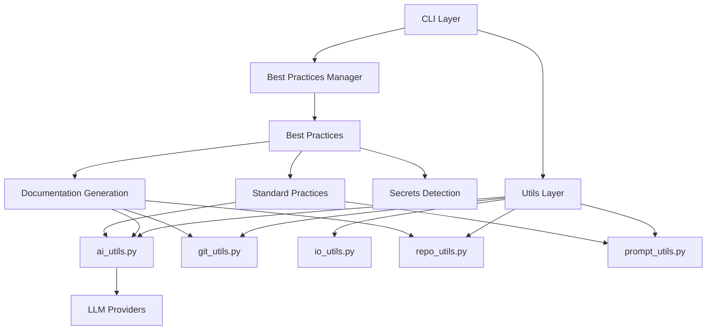
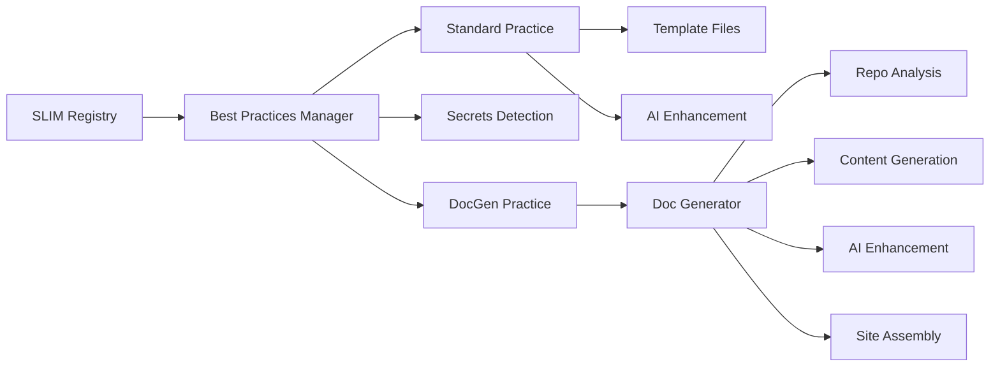
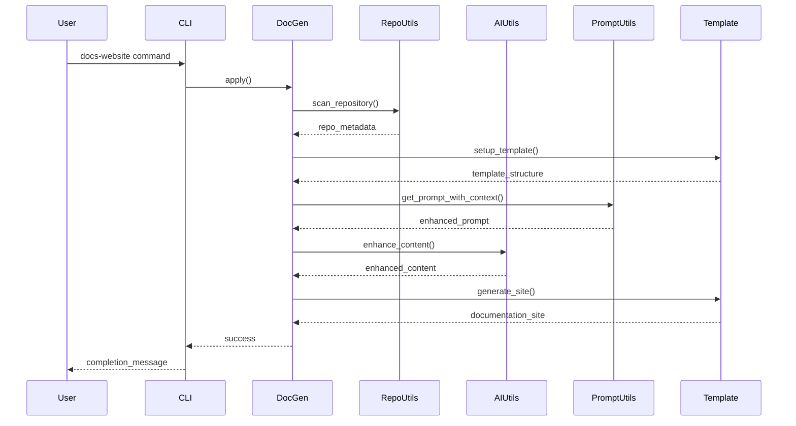

# SLIM CLI Architecture

## Overview

SLIM CLI is a command-line tool designed to automate the application of Software Lifecycle Improvement and Modernization (SLIM) best practices to git repositories. The tool follows a modular architecture with clear separation of concerns, enabling easy extensibility and maintenance.

## Architecture Principles

- **Modular Design**: Clear separation between utilities, best practices, and CLI layers
- **Reusable Components**: Common functionality consolidated in utils layer
- **Extensible System**: Easy to add new best practices and AI providers
- **Library-Agnostic**: Core functions abstracted from specific implementations
- **AI Integration**: Flexible AI/LLM support for content enhancement

## Component Architecture



## Directory Structure

```
slim-cli/
├── src/jpl/slim/
│   ├── commands/           # CLI command implementations
│   ├── manager/           # Best practices manager
│   ├── best_practices/    # Best practice implementations
│   │   ├── base.py        # Base best practice class
│   │   ├── standard.py    # Standard practices (README, etc.)
│   │   ├── secrets_detection.py
│   │   ├── docgen.py      # Documentation generation practice
│   │   └── docgen/        # Simplified docgen modules
│   │       ├── __init__.py
│   │       └── generator.py # Lightweight orchestrator using utils
│   ├── utils/             # Reusable utility modules
│   │   ├── ai_utils.py    # Library-agnostic AI/LLM integration
│   │   ├── git_utils.py   # Git operations & repository info extraction
│   │   ├── io_utils.py    # File I/O operations
│   │   ├── repo_utils.py  # Repository analysis & metadata extraction
│   │   └── prompt_utils.py # Centralized prompt management
│   ├── prompts/           # Centralized prompt configuration
│   │   ├── __init__.py
│   │   └── prompts.yaml   # Hierarchical prompt definitions
│   └── docgen/            # Legacy docgen modules (for gradual migration)
│       ├── analyzer/      # Repository analysis (being phased out)
│       ├── content/       # Content generators
│       ├── enhancer/      # AI enhancement
│       ├── template/      # Template management
│       └── utils/         # Docgen-specific utilities
├── tests/                 # Comprehensive test suite
│   └── jpl/slim/utils/    # Tests for new utility modules
│       ├── test_prompt_utils.py
│       ├── test_repo_utils.py
│       └── test_ai_utils_enhanced.py
└── ARCHITECTURE.md        # This file - architecture documentation
```

## Recent Reorganization

### Key Changes Made

1. **Centralized Prompt Management**: All AI prompts moved to `src/jpl/slim/prompts/prompts.yaml` with hierarchical context support
2. **Extracted Reusable Utilities**: Common functionality moved from docgen to utils layer:
   - Repository analysis → `repo_utils.py`
   - Git operations → `git_utils.py` 
   - AI enhancement → `ai_utils.py` (with library-agnostic naming)
3. **Simplified Docgen**: New lightweight generator in `best_practices/docgen/` that orchestrates utils
4. **Library-Agnostic Naming**: AI functions renamed to focus on capabilities rather than specific libraries
5. **Comprehensive Testing**: New unit tests for all utility modules

### Migration Strategy

The reorganization follows a gradual migration approach:
- New simplified docgen code uses the utils layer
- Legacy docgen modules remain for backward compatibility during transition
- Function aliases maintain backward compatibility for existing code

## Utils Layer

The utils layer provides reusable functionality across all best practices:

### ai_utils.py
- **Purpose**: Library-agnostic AI/LLM integration
- **Key Functions**:
  - `generate_ai_content()`: Generate content using any AI model
  - `enhance_content()`: Enhance existing content with AI using centralized prompts
  - `generate_with_model()`: Primary interface (currently LiteLLM)
  - `validate_model()`: Validate model configuration
- **Features**: Library-agnostic naming, automatic fallbacks, legacy compatibility
- **Supported Providers**: OpenAI, Azure, Anthropic, Ollama, and more via LiteLLM

### git_utils.py
- **Purpose**: Git repository operations and information extraction
- **Key Functions**:
  - `clone_repository()`: Clone repositories
  - `create_branch()`: Create and manage branches
  - `extract_git_info()`: Extract repository metadata (org, URLs, branches)
  - `is_git_repository()`: Check if directory is a git repo
- **Dependencies**: GitPython

### repo_utils.py
- **Purpose**: Repository analysis and metadata extraction
- **Key Functions**:
  - `scan_repository()`: Comprehensive repository structure analysis
  - `extract_project_metadata()`: Extract from package.json, setup.py, pyproject.toml
  - `categorize_directories()`: Identify source, test, documentation dirs
  - `detect_languages()`: Programming language detection with file counts
  - `find_key_files()`: Locate README, LICENSE, etc.
- **Dependencies**: pathlib, tomllib (Python 3.11+), pyyaml
- **Features**: Robust third-party library integration, comprehensive file analysis

### prompt_utils.py
- **Purpose**: Centralized prompt management with optional hierarchical context
- **Key Functions**:
  - `get_prompt_with_context()`: Retrieve prompts with optional inherited context
  - `get_context_hierarchy()`: Collect context from root to leaf levels
  - `load_prompts()`: Load prompts from YAML with caching
  - `validate_prompts_file()`: Validate prompt file structure
- **Features**: Optional context at any level, context inheritance, validation

### io_utils.py
- **Purpose**: File I/O operations and remote resource fetching
- **Key Functions**:
  - `fetch_best_practices()`: Fetch from SLIM registry
  - `read_file_content()`: Safe file reading
  - `fetch_code_base()`: Repository content fetching

## Best Practices System



### Best Practice Types

1. **Standard Practices**: Template-based practices (README, GOVERNANCE, etc.)
2. **Secrets Detection**: Security-focused practices for secret scanning
3. **Documentation Generation**: Comprehensive documentation site generation

### Practice Lifecycle

1. **Fetch**: Retrieve practice definitions from registry
2. **Apply**: Execute practice-specific logic
3. **Enhance**: Optional AI-based customization
4. **Deploy**: Commit and push changes to repository

## Data Flow for Documentation Generation



## AI Integration

### Prompt Management

Prompts are centralized in `src/jpl/slim/prompts/prompts.yaml` with hierarchical context support:

```yaml
# Global context (optional)
context: "Base context for all SLIM practices"

practice_category:
  context: "Category-specific context"  # Optional
  
  specific_practice:
    context: "Practice-specific context"  # Optional
    prompt: "The actual prompt text"
```

Context inheritance flows from root → category → specific practice, with each level being optional.

### Model Support

SLIM CLI supports multiple AI providers through a unified interface:
- **Cloud**: OpenAI, Azure OpenAI, Anthropic, Google AI
- **Local**: Ollama, VLLM
- **Managed**: Groq, Together AI, Cohere

## Extending SLIM CLI

### Adding New Best Practices

1. Create a new class inheriting from `BestPractice`
2. Implement `apply()` and `deploy()` methods
3. Add practice mapping in `practice_mapping.py`
4. Add prompts to `prompts.yaml` if AI enhancement needed
5. Create unit tests

### Adding New AI Providers

1. Add provider configuration to `ai_utils.py`
2. Update `validate_model()` function
3. Add environment variable requirements
4. Test with existing practices

### Testing Guidelines

- **Unit Tests**: Test individual utility functions
- **Integration Tests**: Test complete workflows
- **Mock External Dependencies**: AI services, git operations
- **Test Coverage**: Aim for comprehensive coverage of utils layer

## Code Standards

- **Python Version**: 3.7+ compatibility
- **Type Hints**: Use where beneficial for clarity
- **Docstrings**: Comprehensive documentation for all public functions
- **Error Handling**: Graceful handling with appropriate logging
- **Testing**: Unit tests for all new functionality
- **Modularity**: Keep functions focused and reusable

## Security Considerations

- **API Keys**: Never log or commit API keys
- **Input Validation**: Validate all user inputs
- **File Permissions**: Respect file system permissions
- **Repository Safety**: Validate repository URLs and paths

## Performance Considerations

- **Lazy Loading**: Load AI models and large dependencies only when needed
- **Caching**: Cache repository analysis and template data where appropriate
- **Streaming**: Use streaming for AI responses when possible
- **Resource Management**: Properly clean up temporary files and resources

## Future Enhancements

- **Plugin System**: Support for third-party best practices
- **Configuration Profiles**: Saved configurations for common scenarios
- **Batch Processing**: Process multiple repositories efficiently
- **Web Interface**: Optional web UI for non-CLI users
- **Analytics**: Usage analytics and practice effectiveness metrics