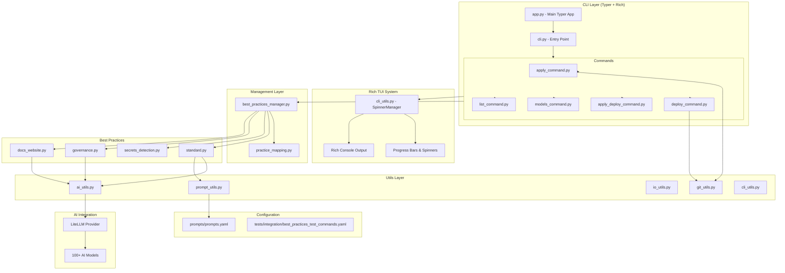
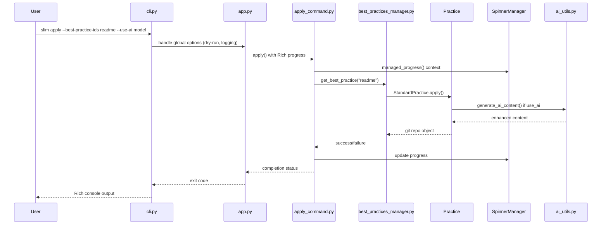
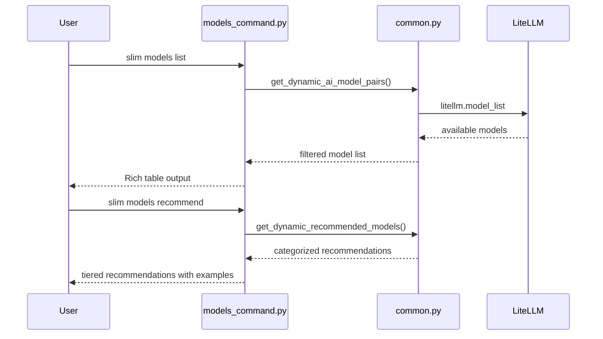

# SLIM CLI Architecture

## Overview

SLIM CLI is a modern command-line tool built with **Typer** and **Rich** that automates the application of Software Lifecycle Improvement and Modernization (SLIM) best practices to git repositories. The tool features a modular architecture with Rich-powered terminal UI, dynamic AI model discovery, and extensible best practice system.

## Architecture Principles

- **Modern CLI Framework**: Built on Typer with Rich TUI integration for enhanced user experience
- **Dynamic Model Discovery**: LiteLLM-powered AI model ecosystem with 100+ supported models
- **Modular Design**: Clear separation between CLI, management, practices, and utilities
- **Extensible System**: Plugin-like architecture for adding new best practices
- **Centralized Configuration**: YAML-based prompts and test configurations
- **Rich Terminal UI**: Progress bars, spinners, and colored output for better UX

## System Architecture



## Directory Structure

```
slim-cli/
├── src/jpl/slim/
│   ├── app.py                  # Main Typer app instance & global state
│   ├── cli.py                  # CLI entry point & legacy compatibility
│   ├── commands/               # Typer command implementations
│   │   ├── apply_command.py           # Apply best practices
│   │   ├── deploy_command.py          # Deploy to git remotes
│   │   ├── apply_deploy_command.py    # Combined apply + deploy
│   │   ├── models_command.py          # AI model management
│   │   ├── list_command.py            # List available practices
│   │   └── common.py                  # Shared command utilities
│   ├── manager/                # Best practices management
│   │   └── best_practices_manager.py  # Practice instantiation & registry
│   ├── best_practices/         # Practice implementations
│   │   ├── base.py                    # Base practice class
│   │   ├── standard.py                # README, CONTRIBUTING, etc.
│   │   ├── secrets_detection.py       # Security scanning practices
│   │   ├── governance.py              # Project governance practices
│   │   ├── docs_website.py            # Documentation site generation
│   │   ├── practice_mapping.py        # Alias → Class mapping system
│   │   └── docs_website_impl/         # DocsWebsite implementation
│   │       ├── generator.py
│   │       ├── site_reviser.py
│   │       └── template_manager.py
│   ├── utils/                  # Reusable utilities
│   │   ├── ai_utils.py               # AI/LLM integration (LiteLLM)
│   │   ├── cli_utils.py              # Spinner management & TUI
│   │   ├── git_utils.py              # Git operations
│   │   ├── io_utils.py               # File I/O & registry fetching
│   │   └── prompt_utils.py           # Centralized prompt management
│   └── prompts/                # Centralized AI prompts
│       └── prompts.yaml              # Hierarchical prompt definitions
├── tests/                      # Test suite
│   ├── integration/
│   │   └── best_practices_test_commands.yaml  # YAML test configuration
│   └── jpl/slim/
│       └── cli/
│           └── test_best_practice_commands.py # Test runner
└── docs/                       # Documentation
    ├── README.md
    ├── ARCHITECTURE.md         # This file
    ├── TESTING.md
    └── CONTRIBUTING.md
```

## Core Components

### 1. Typer CLI Framework (`app.py`, `cli.py`)

**Modern CLI with Rich Integration**
- **Typer App**: Main application instance with Rich markup support
- **Global State Management**: Dry-run mode, logging levels, shared state
- **Rich TUI Features**: Progress bars, spinners, colored output, emojis
- **Command Registration**: Automatic subcommand discovery and registration

```python
# app.py - Core Typer app with Rich markup
app = typer.Typer(
    name="slim",
    help="🛠️  SLIM CLI - Modernizing software through automated best practices.",
    rich_markup_mode="rich",
    epilog="[Examples with Rich formatting]"
)
```

### 2. Rich TUI System (`cli_utils.py`)

**Advanced Terminal User Interface**
- **SpinnerManager**: Coordinates progress indicators during user input
- **managed_progress()**: Context manager for spinner/progress coordination
- **spinner_safe_input()**: User input with automatic spinner management
- **Rich Console Integration**: Colored output, progress bars, spinners

```python
# Spinner management during user interaction
with Progress(...) as progress:
    with managed_progress(progress):
        task = progress.add_task("Applying best practice...", total=None)
        # Work happens here
```

### 3. AI Model System (`ai_utils.py`, `models_command.py`)

**Dynamic Model Discovery with LiteLLM**
- **100+ AI Models**: Automatic discovery via LiteLLM registry
- **Model Commands**: `list`, `recommend`, `setup`, `validate` operations
- **Provider Support**: OpenAI, Anthropic, Groq, Ollama, Together AI, etc.
- **Model Validation**: Format checking and availability testing

```bash
# New AI model commands
slim models list                    # List all available models
slim models recommend --task documentation
slim models setup anthropic         # Provider setup instructions
slim models validate openai/gpt-4   # Test model configuration
```

### 4. Practice Mapping System (`practice_mapping.py`)

**Centralized Extensibility**
- **Alias Mapping**: `ALIAS_TO_PRACTICE_CLASS` for dynamic instantiation
- **File Path Mapping**: `ALIAS_TO_FILE_PATH` for StandardPractice files
- **Practice Classification**: Helper functions for practice type detection
- **Extension Points**: Easy addition of new practices

```python
# Adding a new practice
ALIAS_TO_PRACTICE_CLASS = {
    'new-practice': 'NewPracticeClass',
    # ... existing mappings
}
```

### 5. Centralized Prompts (`prompts/prompts.yaml`)

**Hierarchical AI Prompt Management**
- **YAML Configuration**: Structured prompt definitions with inheritance
- **Context Hierarchy**: Global → Category → Specific prompt context
- **Repository Context**: Configurable repo information for AI prompts
- **MDX Safety Rules**: Strict guidelines for documentation generation

```yaml
# Hierarchical prompt structure
standard_practices:
  context: "Global context for standard practices"
  readme:
    context: "README-specific context"
    prompt: "Fill out ONLY the placeholders..."
    repository_context:
      categories: ["documentation", "structure"]
      max_characters: 8000
```

### 6. Testing Framework (`tests/integration/best_practices_test_commands.yaml`)

**YAML-Based Test Configuration**
- **Enable/Disable Toggles**: Selective test execution
- **Template Variables**: `{temp_git_repo}`, `{test_ai_model}`, `{custom_remote}`
- **Parameterized Commands**: Test multiple scenarios per practice
- **Error Scenario Testing**: Comprehensive failure case coverage

```yaml
# YAML test configuration
readme:
  enabled: true
  commands:
    - command: "slim apply --best-practice-ids readme --repo-dir {temp_git_repo}"
      enabled: true
    - command: "slim deploy --best-practice-ids readme --repo-dir {temp_git_repo_with_remote}"
      enabled: true
```

## Command Flow Architecture

### Apply Command Flow



### Models Command Flow



## Best Practice Types

### 1. Standard Practices (`standard.py`)
- **Template-based**: README, CONTRIBUTING, LICENSE, etc.
- **AI Enhancement**: Optional customization with repository context
- **File Mapping**: Uses `practice_mapping.py` for file placement
- **Git Integration**: Automatic branching and repository setup

### 2. Secrets Detection (`secrets_detection.py`)
- **Security-focused**: GitHub Actions and pre-commit hooks
- **Rule-based**: No AI required, uses predefined configurations
- **Dependency Management**: Handles tool installation with user prompts

### 3. Governance Practices (`governance.py`)
- **Project Governance**: Small, medium, large governance templates
- **Contributor Integration**: Git statistics for team member lists
- **Template Enhancement**: AI-powered contributor information filling

### 4. Documentation Website (`docs_website.py`)
- **Comprehensive**: Full documentation site generation
- **AI-Powered**: Extensive use of AI for content enhancement
- **Site Revision**: Update existing documentation sites
- **MDX Compliance**: Strict safety rules for Docusaurus compatibility

## Extensibility System

### Adding New Best Practices

1. **Create Practice Class**
   ```python
   class NewPractice(BestPractice):
       def apply(self, repo_path, **kwargs):
           # Implementation
   ```

2. **Update Practice Mapping**
   ```python
   # practice_mapping.py
   ALIAS_TO_PRACTICE_CLASS['new-practice'] = 'NewPractice'
   ```

3. **Add AI Prompts** (optional)
   ```yaml
   # prompts.yaml
   new_practice:
     context: "Context for new practice"
     prompt: "AI instructions"
   ```

4. **Add Test Configuration**
   ```yaml
   # best_practices_test_commands.yaml
   new-practice:
     enabled: true
     commands:
       - command: "slim apply --best-practice-ids new-practice --repo-dir {temp_git_repo}"
   ```

5. **Update Manager**
   ```python
   # best_practices_manager.py - handled automatically via practice_mapping.py
   ```

### Adding New AI Providers

1. **LiteLLM Integration** (automatic for supported providers)
2. **Environment Variables** in documentation
3. **Validation Logic** in `ai_utils.py`
4. **Setup Instructions** in `models_command.py`

## Rich TUI Features

### Progress Management
- **SpinnerManager**: Global singleton for progress coordination
- **Context Managers**: Automatic pause/resume during user input
- **Progress Types**: Spinners for indeterminate tasks, progress bars for known totals
- **Transient Display**: Clean terminal output after completion

### Console Output
- **Rich Markup**: Colors, styles, emojis in help text and output
- **Error Handling**: Colored error messages with proper exit codes
- **Success Messages**: Formatted success output with repository details
- **Dry-Run Mode**: Detailed execution preview without side effects

## Performance Considerations

### Lazy Loading
- **LiteLLM Import**: Optional import with graceful fallback
- **AI Models**: Only loaded when needed
- **Repository Analysis**: Cached during single command execution

### Resource Management
- **Temporary Directories**: Proper cleanup with `create_repo_temp_dir()`
- **Git Repository Objects**: Efficient reuse within practice application
- **Progress Contexts**: Automatic cleanup of progress displays

## Security Considerations

### API Key Management
- **Environment Variables**: Secure API key storage
- **No Logging**: API keys never logged or exposed
- **Model Validation**: Safe model string parsing

### Repository Safety
- **Path Validation**: Secure handling of repository paths
- **Git URL Parsing**: Safe remote URL handling
- **Temporary Files**: Secure temporary directory creation

## Future Architecture Enhancements

### Plugin System
- **External Practices**: Load practices from external packages
- **Practice Discovery**: Automatic detection of installed practice plugins
- **Configuration Schema**: Standardized plugin configuration

### Enhanced AI Integration
- **Model Caching**: Local model caching for faster responses
- **Streaming Responses**: Real-time AI content generation
- **Multi-model Workflows**: Different models for different practice types

### Advanced TUI Features
- **Interactive Mode**: Menu-driven practice selection
- **Real-time Previews**: Live preview of changes before application
- **Undo/Redo**: Rollback capabilities for applied practices

This architecture reflects the current state of SLIM CLI as a modern, extensible, and user-friendly command-line tool built on contemporary Python CLI best practices.