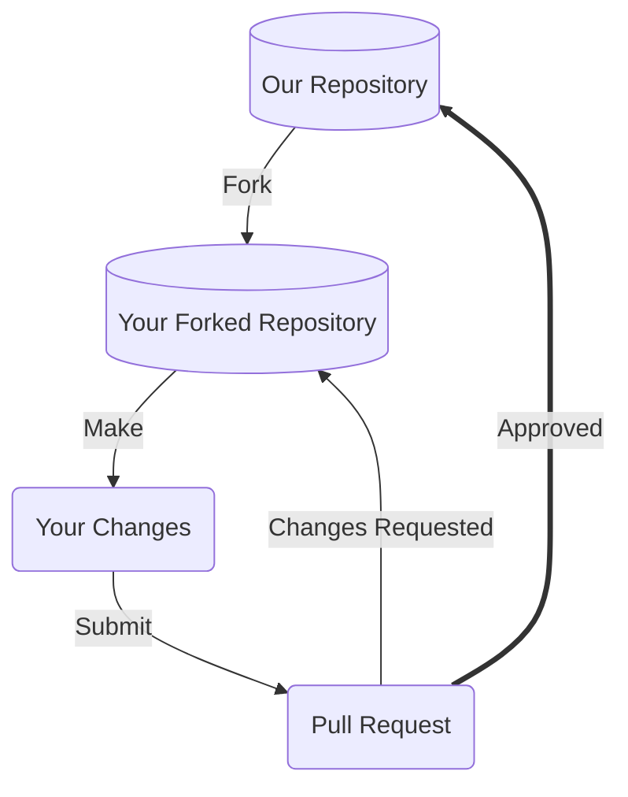
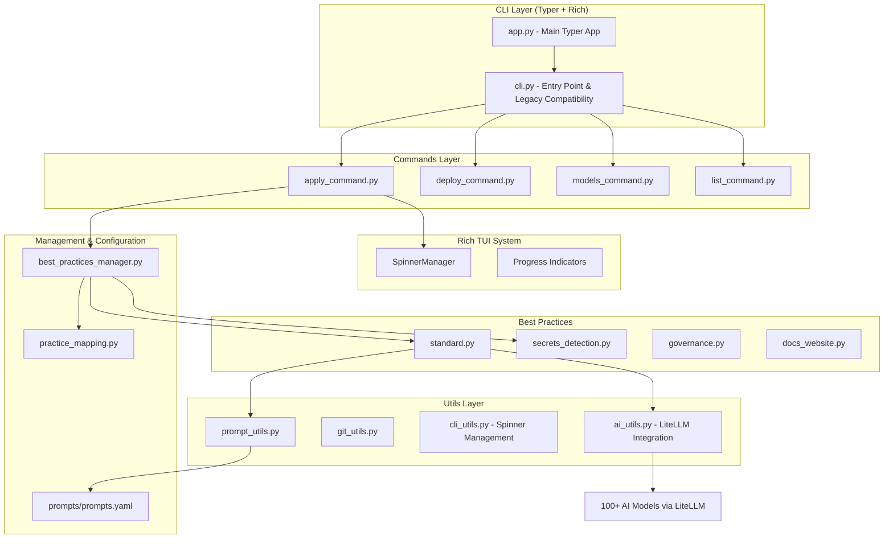

# Contributing Guide

Thanks for taking the time to consider contributing! We very much appreciate your time and effort. This document outlines the many ways you can contribute to our project, and provides detailed guidance on best practices. We look forward to your help!

## Prerequisites

Before you begin contributing to our project, it'll be a good idea to ensure you've satisfied the below pre-requisites. 

### License

Our project has our licensing terms, including rules governing redistribution, documented in our [LICENSE](LICENSE) file. Please take a look at that file and ensure you understand the terms. This will impact how we, or others, use your contributions.

### Code of Conduct

Our Code of Conduct helps facilitate a positive interaction environment for everyone involved with the team, and provides guidance on what to do if you experience problematic behavior. Read more in our [CODE_OF_CONDUCT.md](CODE_OF_CONDUCT.md), and make sure you agree to its terms. 

### Developer Environment

For patch contributions, see our [README.md](README.md) for more details on how to set up your local environment, to best contribute to our project.

**Development Dependencies:**
- Python 3.7+
- Git
- **Optional**: LiteLLM for AI model support (`pip install litellm`)
- pytest for testing (`pip install pytest pytest-cov`)
- Typer and Rich for CLI development (`pip install typer rich`)

At a minimum however to submit patches (if using Git), you'll want to ensure you have:
1. An account on the Version Control System our project uses (i.e. GitHub).
2. The Version Control System client (i.e. Git) installed on your local machine.
3. The ability to edit, build, and test our project on your local machine. Again, see our [README.md](README.md) for more details.
4. Understanding of the modern CLI framework (Typer + Rich) used in this project.

### Communication Channels

Before contributing changes to our project, it's a great idea to be familiar with our communication channels and to socialize your potential contributions to get feedback early. This will help give you context for your contributions, no matter their form.

Our communication channels are:
- [Issue tracking system](https://github.com/nasa-jpl/slim/issues) - a regularly monitored area to report issues with our software or propose changes
- [Discussion board](https://github.com/nasa-jpl/slim/discussions) - an permanently archived place to hold conversations related to our project, and to propose as well as show+tell topics to the contributor team. This resource can be searched for old discussions.

## Our Development Process

Our project integrates contributions from many people, and so we'd like to outline a process you can use to visualize how your contributions may be integrated if you provide something. 



### Fork our Repository

Forking our repository, as opposed to directly committing to a branch is the preferred way to propose changes. 

See [this GitHub guide](https://docs.github.com/en/get-started/quickstart/fork-a-repo) on forking for information specific to GitHub.com

#### Find or File an Issue

Make sure people are aware you're working on a patch! Check out our [issue tracking system](https://github.com/nasa-jpl/slim/issues) and find an open issue you'd like to work against, or alternatively file a new issue and mention you're working on a patch.

#### Choose the Right Branch to Fork

Our project typically has the following branches available, make sure to fork either the default branch or a branch someone else already tagged with a particular issue ticket you're working with.
- `main` - default branch

### Make your Modifications

Within your local development environment, this is the stage at which you'll propose your changes, and commit those changes back to version control. See the [README.md](README.md) for more specifics on what you'll need as prerequisites to setup your local development environment.

#### Commit Messages

Commit messages to version control should reference a ticket in their title / summary line:

```
Issue #248 - Show an example commit message title
```

This makes sure that tickets are updated on GitHub with references to commits that are related to them.

Commit should always be atomic. Keep solutions isolated whenever possible. Filler commits such as "clean up white space" or "fix typo" should be merged together before making a pull request, and significant sub-feature branches should be [rebased](https://www.youtube.com/results?search_query=git+rebase) to preserve commit history. Please ensure your commit history is clean and meaningful!

### Submit a Pull Request

Pull requests are the core way our project will receive your patch contributions. Navigate to your branch on your own fork within the version control system, and submit a pull request or submit the patch text to our project. 

Please make sure to provide a meaningful text description to your pull requests, whenever submitted.

**Working on your first Pull Request?** See guide: [How to Contribute to an Open Source Project on GitHub](https://kcd.im/pull-request)

### Reviewing your Pull Request

Reviewing pull-requests, or any kinds of proposed patch changes, is an art. That being said, we follow the following best practices:
- **Intent** - is the purpose of your pull-request clearly stated?
- **Solution** - is your pull-request doing what you want it to?
- **Correctness** - is your pull-request doing what you want it to *correctly*?
- **Small Patches** - is your patch of a level of complexity and brevity that it can actually be reviewed by a human being? Or is does it involve too much content for one pull request?
- **Coding best practices** - are you following best practices in the coding / contribution language being used?
- **Readability** - is your patch readable, and ultimately maintainable, by others?
- **Reproducibility** - is your patch reproducible by others?
- **Tests** - do you have or have conducted meaningful tests?

## SLIM Architecture and Extension Points

This section provides an overview of the SLIM codebase architecture and explains how to extend it by adding new best practices and commands.

### Architectural Overview

SLIM CLI is built on a modern architecture using **Typer** for CLI framework and **Rich** for terminal UI. The system features dynamic AI model discovery, extensible best practice mapping, and YAML-based testing. The main components are:



#### Key Components

1. **Typer CLI Framework** (`src/jpl/slim/app.py`, `src/jpl/slim/cli.py`):
   - **app.py**: Main Typer application instance with Rich markup support
   - **cli.py**: Entry point and legacy compatibility layer
   - Features: Rich TUI, dry-run mode, global state management
   - Uses decorators: `@app.command()` for command registration

2. **Commands Package** (`src/jpl/slim/commands/`):
   - **Modern Typer Commands**: Each command uses Typer decorators and type hints
   - **Rich Integration**: Progress bars, spinners, and colored output
   - **Key Commands**:
     - `apply_command.py`: Apply best practices with Rich progress indicators
     - `models_command.py`: AI model discovery and management (NEW)
     - `deploy_command.py`: Git deployment with spinner feedback
     - `list_command.py`: List available practices

3. **Rich TUI System** (`src/jpl/slim/utils/cli_utils.py`):
   - **SpinnerManager**: Global progress coordination during user input
   - **managed_progress()**: Context manager for spinner/progress coordination
   - **spinner_safe_input()**: Clean user input with automatic progress pause/resume

4. **Practice Mapping System** (`src/jpl/slim/best_practices/practice_mapping.py`):
   - **ALIAS_TO_PRACTICE_CLASS**: Central mapping for extensibility
   - **ALIAS_TO_FILE_PATH**: File placement mapping for StandardPractice
   - **Helper Functions**: Practice type detection and classification
   - **Extension Point**: Add new practices by updating mappings

5. **Best Practices Package** (`src/jpl/slim/best_practices/`):
   - **Base Classes**: Abstract interfaces for different practice types
   - **Standard Practices**: Template-based practices (README, CONTRIBUTING, etc.)
   - **Secrets Detection**: Security-focused practices
   - **Governance**: Project governance with git contributor integration
   - **Documentation Website**: AI-powered documentation site generation

6. **AI Integration** (`src/jpl/slim/utils/ai_utils.py`, `src/jpl/slim/prompts/`):
   - **LiteLLM Integration**: 100+ AI models with automatic discovery
   - **Centralized Prompts**: YAML-based prompt management with inheritance
   - **Model Management**: Validation, recommendations, and setup instructions
   - **Repository Context**: Configurable context extraction for AI enhancement

7. **Utils Layer** (`src/jpl/slim/utils/`):
   - **ai_utils.py**: LiteLLM integration and model management
   - **cli_utils.py**: Rich TUI utilities and spinner management
   - **git_utils.py**: Git operations with `create_repo_temp_dir()` helper
   - **prompt_utils.py**: Centralized prompt loading and context management
   - **io_utils.py**: File I/O and registry operations

### Extension Points

SLIM is designed to be easily extended with new best practices and commands. Here's how to add new functionality:

#### Adding a New Best Practice

⚠️ **Prerequisites**: Ensure your best practice is in the SLIM registry first:
1. See: https://nasa-ammos.github.io/slim/docs/contribute/submit-best-practice#add-entry-to-the-registry
2. Run `slim list` to get the auto-generated ID
3. Proceed with implementation steps below

**Modern Best Practice Implementation Process:**

SLIM uses a centralized mapping system for extensibility. To add a new best practice:

**1. Update Practice Mapping** (`src/jpl/slim/best_practices/practice_mapping.py`):

```python
# Add your practice to the central mapping
ALIAS_TO_PRACTICE_CLASS = {
    # Existing mappings...
    'your-new-practice': 'YourNewPracticeClass',  # Add this line
}

# If it's a StandardPractice, add file path mapping:
ALIAS_TO_FILE_PATH = {
    # Existing mappings...
    'your-new-practice': 'YOUR_PRACTICE_FILE.md',  # Add this line
}
```

**2. Create Practice Class** (choose appropriate base class):

**Option A: StandardPractice (template-based)**
```python
# No new class needed! StandardPractice uses practice_mapping.py automatically
# Just update the mapping above and you're done
```

**Option B: Custom Practice Class**
```python
from jpl.slim.best_practices.base import BestPractice
from rich.console import Console
from rich.progress import Progress, SpinnerColumn, TextColumn
from jpl.slim.utils.cli_utils import managed_progress

class YourNewPracticeClass(BestPractice):
    """
    Your new best practice implementation.
    
    This class implements a specific best practice for [describe purpose].
    """
    
    def __init__(self, best_practice_id, uri, title, description):
        """Initialize with parameters from manager."""
        super().__init__(best_practice_id, uri, title, description)
        self.console = Console()
    
    def apply(self, repo_path, use_ai=False, model=None, **kwargs):
        """
        Apply your best practice with Rich UI integration.
        
        Args:
            repo_path (str): Path to the repository
            use_ai (bool): Whether to use AI assistance
            model (str): AI model to use (anthropic/claude-3-5-sonnet-20241022, etc.)
            **kwargs: Additional arguments from CLI
            
        Returns:
            git.Repo or None: Git repository object if successful
        """
        # Use Rich progress indicators
        with Progress(
            SpinnerColumn(),
            TextColumn("[progress.description]{task.description}"),
            console=self.console,
            transient=True
        ) as progress:
            with managed_progress(progress):
                task = progress.add_task(f"Applying {self.best_practice_id}...", total=None)
                
                # Your implementation here
                # Use self.console.print() for output
                # Return git.Repo object for success, None for failure
                pass
```

**3. Update Best Practices Manager** (`src/jpl/slim/manager/best_practices_manager.py`):

```python
# Add import for custom practice classes (not needed for StandardPractice)
from jpl.slim.best_practices.your_new_practice import YourNewPracticeClass

# Update the practice class mapping constants
from jpl.slim.best_practices.practice_mapping import (
    PRACTICE_CLASS_STANDARD,
    PRACTICE_CLASS_SECRETS,
    PRACTICE_CLASS_DOCSWEBSITE,
    PRACTICE_CLASS_GOVERNANCE,
    # No changes needed here - mapping handles everything automatically
)

# The get_best_practice() method automatically uses practice_mapping.py
# No manual registration required!
```

#### Adding a New Command

SLIM CLI uses **Typer** with **Rich** integration. To add a new command:

**1. Create a new command module** in `src/jpl/slim/commands/`:

```python
"""
Your new command module for the SLIM CLI.

This module contains the Typer implementation of the 'your-command' subcommand.
"""

import logging
from typing import Optional, List
from pathlib import Path
import typer
from rich.console import Console
from rich.progress import Progress, SpinnerColumn, TextColumn

from jpl.slim.app import app, state, handle_dry_run_for_command
from jpl.slim.utils.cli_utils import managed_progress
from jpl.slim.manager.best_practices_manager import BestPracticeManager
from jpl.slim.utils.io_utils import fetch_best_practices
from jpl.slim.commands.common import SLIM_REGISTRY_URI

console = Console()

@app.command()
def your_command(
    your_arg: str = typer.Option(
        ..., 
        "--your-arg", "-y",
        help="Description of your required argument"
    ),
    optional_arg: Optional[str] = typer.Option(
        None,
        "--optional-arg",
        help="Description of optional argument"
    ),
    flag_arg: bool = typer.Option(
        False,
        "--flag-arg",
        help="Boolean flag argument"
    ),
    dry_run: bool = typer.Option(
        False,
        "--dry-run", "-d",
        help="Show what would be executed without making changes"
    ),
    logging_level: str = typer.Option(
        None,
        "--logging", "-l",
        help="Set the logging level: DEBUG, INFO, WARNING, ERROR, CRITICAL"
    )
):
    """
    Your command description here.
    
    This command does [explain what it does] with Rich terminal UI integration.
    """
    # Configure logging
    from jpl.slim.commands.common import configure_logging
    configure_logging(logging_level, state)
    
    logging.debug(f"Starting your-command with arg: {your_arg}")
    
    # Handle dry-run mode
    if state.dry_run or dry_run:
        if handle_dry_run_for_command(
            "your-command",
            your_arg=your_arg,
            optional_arg=optional_arg,
            flag_arg=flag_arg,
            dry_run=True
        ):
            return
    
    # Implement your command with Rich progress
    with Progress(
        SpinnerColumn(),
        TextColumn("[progress.description]{task.description}"),
        console=console,
        transient=True
    ) as progress:
        with managed_progress(progress):
            task = progress.add_task("Executing your command...", total=None)
            
            try:
                # Your command logic here
                practices = fetch_best_practices(SLIM_REGISTRY_URI)
                manager = BestPracticeManager(practices)
                
                progress.update(task, description="Processing...")
                
                # Your implementation
                # Use console.print() for user output
                # Use logging.debug/info/error for debug output
                
                progress.update(task, description="Completed successfully")
                console.print(f"✅ [green]Your command completed successfully[/green]")
                
            except Exception as e:
                console.print(f"❌ [red]Error in your command: {str(e)}[/red]")
                raise typer.Exit(1)
```
```

**2. Register your command** by importing it:

The command is automatically registered when imported. Add to `src/jpl/slim/cli.py`:

```python
# Import your command to register it with the Typer app
from jpl.slim.commands import your_command  # This auto-registers the @app.command()
```

**3. No manual registration needed!** 

Typer automatically discovers commands decorated with `@app.command()`. The import in `cli.py` ensures your command is loaded when the CLI starts.

### Testing Your Extensions

SLIM CLI uses a comprehensive testing framework combining pytest with YAML-based integration testing:

**1. Add YAML Integration Tests** (`tests/integration/best_practices_test_commands.yaml`):

```yaml
# Add your new practice to the YAML test configuration
your-new-practice:
  enabled: true  # Set to false to skip during development
  commands:
    # Success scenarios
    - command: "slim apply --best-practice-ids your-new-practice --repo-dir {temp_git_repo}"
      enabled: true
    - command: "slim deploy --best-practice-ids your-new-practice --repo-dir {temp_git_repo_with_remote}"
      enabled: true
    # AI enhancement testing
    - command: "slim apply --best-practice-ids your-new-practice --repo-dir {temp_git_repo} --use-ai {test_ai_model}"
      enabled: true
    # Error scenarios
    - command: "slim apply --best-practice-ids your-new-practice --repo-dir /nonexistent/path"
      enabled: true
```

**2. Write Unit Tests** (`tests/jpl/slim/best_practices/test_your_practice.py`):

```python
import pytest
from unittest.mock import Mock, patch
from typer.testing import CliRunner
from jpl.slim.app import app
from jpl.slim.best_practices.your_practice import YourNewPracticeClass

class TestYourNewPractice:
    def test_apply_success(self):
        """Test successful application of your practice."""
        practice = YourNewPracticeClass("your-practice", "uri", "title", "desc")
        result = practice.apply("/test/repo")
        assert result is not None
    
    def test_command_integration(self):
        """Test CLI command integration."""
        runner = CliRunner()
        result = runner.invoke(app, ["your-command", "--your-arg", "test", "--dry-run"])
        assert result.exit_code == 0
        assert "Dry run complete" in result.stdout
```

**3. Run Tests**:

```bash
# Run all tests
pytest

# Run only your new tests
pytest tests/jpl/slim/best_practices/test_your_practice.py

# Run YAML integration tests
pytest tests/jpl/slim/cli/test_best_practice_commands.py

# Test with coverage
pytest --cov=jpl.slim

# Run tests (no special environment variable needed)
```

**4. Manual Testing**:

```bash
# Test your new practice
slim apply --best-practice-ids your-new-practice --repo-dir /path/to/test/repo --dry-run

# Test with AI enhancement
slim apply --best-practice-ids your-new-practice --repo-dir /path/to/test/repo --use-ai ollama/llama3.1 --dry-run

# Test new command
slim your-command --your-arg test --dry-run
```

### AI Integration for New Practices

To add AI enhancement support for your new best practice:

**1. Add Prompts** (`src/jpl/slim/prompts/prompts.yaml`):

```yaml
# Add your practice prompts with hierarchical context
your_practice_category:
  context: "Context for your practice category"
  
  your_specific_practice:
    context: "Specific context for your practice"
    prompt: "AI instructions for enhancing your practice..."
    repository_context:
      categories: ["documentation", "structure"]
      max_characters: 8000
      include_patterns: ["*.md", "*.py"]
```

**2. Use AI in Your Practice**:

```python
from jpl.slim.utils.ai_utils import generate_ai_content
from jpl.slim.utils.prompt_utils import get_prompt_with_context
from jpl.slim.utils.io_utils import fetch_repository_context

def apply(self, repo_path, use_ai=False, model=None, **kwargs):
    # ... your practice logic ...
    
    if use_ai and model:
        # Get prompt with context inheritance
        prompt = get_prompt_with_context('your_practice_category', 'your_specific_practice')
        
        # Get repository context
        repo_context = fetch_repository_context(repo_path, context_config)
        
        # Generate AI content
        ai_content = generate_ai_content(f"{prompt}\n\nRepo Context: {repo_context}", model)
        
        # Apply AI-enhanced content
        # ...
```

**3. Test AI Integration**:

```bash
# Test with different AI models
slim apply --best-practice-ids your-practice --use-ai anthropic/claude-3-5-sonnet-20241022 --repo-dir test-repo
slim apply --best-practice-ids your-practice --use-ai openai/gpt-4o --repo-dir test-repo
slim apply --best-practice-ids your-practice --use-ai ollama/llama3.1 --repo-dir test-repo

# Validate model before testing
slim models validate anthropic/claude-3-5-sonnet-20241022
```

## Ways to Contribute

### ⚠️ Issue Tickets

> *Do you like to talk about new features, changes, requests?*

Issue tickets are a very simple way to get involved in our project. It also helps new contributors get an understanding of the project more comprehensively. This is a great place to get started with the project if you're not sure where to start. 

See our list of issues at: [https://github.com/nasa-jpl/slim/issues](https://github.com/nasa-jpl/slim/issues)

#### Cleaning up Duplicate Issues

Often we receive duplicate issues that can confuse project members on *which* issue ticket to hold conversations upon.

Here's how you can help:
1. Scan the list of *open* issue tickets for duplicate titles, or internal wording 
2. If you find duplicates, copy / paste the below message on the conversation thread of the issue ticket *that has less participants* involved

```
This is a duplicate issue. Please migrate conversations over to [issue-XYZ](hyperlink to issue)
```

#### Good First Issues

Issue tickets can vary in complexity, and issues labeled with `good first issue` labels are often a great way to get started with the project as a newcomer. 

Take a look at our [issue tracking system](https://github.com/nasa-jpl/slim/issues), and filter by `good first issue` for issues that are low-complexity, and that will help you get familiar with our issue tracking and patch submission process.

#### Suggesting New Issue Labels

Labels within our [issue tracking system](https://github.com/nasa-jpl/slim/issues) are a great way to quickly sort through tickets. The project may not yet have labels to cover the full variety of issue tickets. Take a look through our list of issues, and if you notice a set of issue tickets that seem similar but are not categorized with an existing label, go ahead submit a request within one of the issues you've looked at with the following text:

```
I've noticed several other issues that are of the same category as this issue. Shall we make a new label for these types of issues?
```

#### Submitting Bug Issues

Resolving bugs is a priority for our project. We welcome bug reports. However, please make sure to do the following prior to submitting a bug report:
- **Check for duplicates** - there may be a bug report already describing your issue, so check the [issue tracking system](https://github.com/nasa-jpl/slim/issues) first.

Here's some guidance on submitting a bug issue:
1. Navigate to our [issue tracking system](https://github.com/nasa-jpl/slim/issues) and file a new issue
2. Select a bug template (if available) for your issue
   1. Fill out the template fields to the best of your ability, including output snippets or screenshots where applicable
3. Follow the general guidelines below for extra information about your bug
   1. Include a code snippet if you have it showcasing the bug
   2. Provide reproducible steps of how to recreate the bug
   3. If the bug triggers an exception or error message, include the *full message* or *stacktrace*
   4. Provide information about your operating system and the version of our project you're using

#### Submitting New Feature Issues

We welcome new feature requests to help grow our project. However, please make sure to do the following prior to submitting a new feature request:
- **Check for duplicates** - there may be a new feature issue already describing your issue, so check the [issue tracking system](https://github.com/nasa-jpl/slim/issues) first
- **Consider alternatives** - is your feature really needed? Or is there a feature within our project or with a third-party that may help you achieve what you want?

Here's some guidance on submitting a new feature issue:
1. Navigate to our [issue tracking system](https://github.com/nasa-jpl/slim/issues) and file a new issue
2. Select a new feature template (if available) for your issue
   1. Fill out the template fields to the best of your ability

#### Submitting Security Vulnerability Issues

Security vulnerabilities should **not** be filed to the regular issue tracking system.

Report your security vulnerabilities to the project maintainers directly.

Please be sure to:
* Indicate the severity of the vulnerability
* Provide any workarounds, if you know them
* Provide return-contact information to follow-up with you if needed

#### Reviewing Pull Requests

Reviewing others' contributions is a great way to learn about best practices in both contributions as well as software. 

Take a look at our [pull requests tracking system](https://github.com/nasa-jpl/slim/pulls), and try the following options for providing a review:
1. Read the code / patch associated with the pull-request, and take note of any coding, bug, or documentation issues if found
2. Try to recreate the pull-request patch on your local machine, and report if it has issues with your system in particular
3. Scan over suggested feedback from other contributors, and provide feedback if necessary

### 💻 Code

⚠️ It's **highly** advised that you take a look at our [issue tracking system](https://github.com/nasa-jpl/slim/issues) before considering any code contributions. Here's some guidelines:
1. Check if any duplicate issues exist that cover your code contribution idea / task, and add comments to those tickets with your thoughts.
2. If no duplicates exist, create a new issue ticket and get a conversation started before making code changes using our [communication channels](#communication-channels).

Once you have a solid issue ticket in hand and are ready to work on code, you'll want to:
1. Ensure you have development [prerequisites](#prerequisites) cleared.
2. Have your [development environment](#developer-environment) set up properly.
3. Go through our [development process](#our-development-process), including proposing changes to our project.

Some guidelines for code-specific contributions:
- **Do your homework** - read-up on necessary documentation, like `README.md`s, developer documentation, and pre-existing code to see the intention and context necessary to make your contribution a success. It's important to _communicate_ what you're working on through our project [communication channels](#communication-channels) and get buy-in from frequent contributors - this will help the project be more receptive to your contributions! 
- **Ask questions** - its important to ask questions while you work on your contributions, to check-in with frequent contributors on the style and the set of expectations to make your code contribution work well with pre-existing project code. Use our [communication channels](#communication-channels)
- **Keep positive** - code contributions, by their nature, have direct impacts on the output and functionality of the project. Keep a positive spirit as your code is reviewed, and take it in stride if core contributors take time to review, give you suggestions for your code or respectfully decline your contribution. This is all part of the process for quality open source development. 
- **Comments** - include *useful* comments throughout your code that explain the intention of a code block, not a step-by-step analysis. See our [inline code documentation](#inline-code-documentation) section for specifics. 

### 📖 Documentation 

Documentation is the core way our users and contributors learn about the project. We place a high value on the quality, thoroughness, and readability of our documentation. Writing or editing documentation is an excellent way to contribute to our project without performing active coding. 

⚠️ It's **highly** advised that you take a look at our [issue-tracking system](https://github.com/nasa-jpl/slim/issues) before considering any documentation contributions. Here's some guidelines:
1. Check if any duplicate issues exist that cover your documentation contribution idea / task, and add comments to those tickets with your thoughts.
2. If no duplicates exist, create a new issue ticket and get a conversation started before making documentation changes.

Some guidelines for documentation best practices (summarized from Google's [excellent documentation guide](https://google.github.io/styleguide/docguide/best_practices.html)):
- **Minimum viable docs** - don't do less documentation than your users / developers need, but also don't do more
- **Changed code = changed docs** - if your code has changed, remember to update your documentation
- **Delete old docs** - continually clean your documentation tree, and remove outdated docs regularly

#### Documentation Organization

The overall structure of our project documentation is as follows:
- Source-controlled documentation
  - [README.md](README.md) - top-level information about how to run, build, and contribute to the project
  - [CODE_OF_CONDUCT.md](CODE_OF_CONDUCT.md) - best practices and guidance on how to work well with other people in the project, and suggestions on dealing with interpersonal issues
  - [CONTRIBUTING.md](CONTRIBUTING.md) - guidance on contributing to the project
  - `*.py` - inline documentation available inside code files

For directions on contributing to our source-controlled documentation:
1. Ensure you have development [prerequisites](#prerequisites) cleared.
2. Have your [development environment](#developer-environment) set up properly.
3. Go through our [development process](#our-development-process), including proposing changes to our project.

#### Writing Style

To ensure documentation is readable and consistent by newcomers and experts alike, here are some suggestions on writing style for English:
- Use gender neutral pronouns (they/their/them) instead of he/she/his/her 
- Avoid qualifiers that minimize the difficulty of a task at hand, e.g. avoid words like "easily", "simply", "just", "merely", "straightforward", etc. Readers' expertise may not match your own, and qualifying complexity may deter some readers if the task does not match their level of experience. That being said, if a particular task is difficult or complex, do mention that. 

#### Inline Code Documentation

For language-specific guidance on code documentation, including style guides, see [Google's list of language style guides](https://google.github.io/styleguide/) for a variety of languages. 

Additionally, take a look at Google's recommendations on [inline code documentation](https://google.github.io/styleguide/docguide/best_practices.html#documentation-is-the-story-of-your-code) for best practices. 

#### Media

Media, such as such as images, videos, sound files, etc., are an excellent way to explain documentation to a wider audience more easily. Include media in your contributions as often as possible.

When including media into our version-control system, it is recommended to use formats such as:
- Diagrams: [Mermaid](https://mermaid-js.github.io/mermaid/#/) format
- Images: JPEG format
- Videos: H264 MPEG format
- Sounds: MP3 format

### ❓ Questions

Answering questions is an excellent way to learn more about our project, as well as get better known in our project community. 

Here are just a few ways you can help answer questions for our project:
- Answer open questions in our [discussion forum](https://github.com/nasa-jpl/slim/discussions)
- Answer open questions mentioned in our [issue tracking system](https://github.com/nasa-jpl/slim/issues)

When answering questions, keep the following in mind:
- Be polite and friendly. See our [Code of Conduct](CODE_OF_CONDUCT.md) recommendations as you interact with others in the team.
- Repeat the specific question you are answering, followed by your suggestion.
- If suggesting code, repeat the line of code that needs to be altered, followed by your alteration
- Include any post-steps or checks to verify your answer can be reproduced 

### 🎨 Design

Design files can help to guide new features and new areas of expansion for our project. We welcome these kinds of contributions.

Here are just a few ways you can help provide design recommendations for our project:
- Create visual mockups or diagrams to increase usability of our project applications. This can apply to user interfaces, documentation structuring, or even code architecture diagrams.
- Conduct user research to understand user needs better. Save your findings within spreadsheets that the project team / contributors can review.
- Create art, such as logos or icons, to support the user experience for the project

Each of the above can be contributed directly to repository code, and you should use our [development process](#our-development-process) to contribute your additions.

### 🎟️ Meetups

A great way to contribute towards our project goals is to socialize and encourage people to meet and learn more about each other. Consider ideas like:
- Propose workshops or meetups regarding some topic within our project
- Help point project contributors and community members to conferences and publications where they may socialize their unique innovations
- Schedule in-person or virtual happy-hours to help create a more social atmosphere within the project community

For the above ideas, use our [communication channels](#communication-channels) to propose get-togethers.